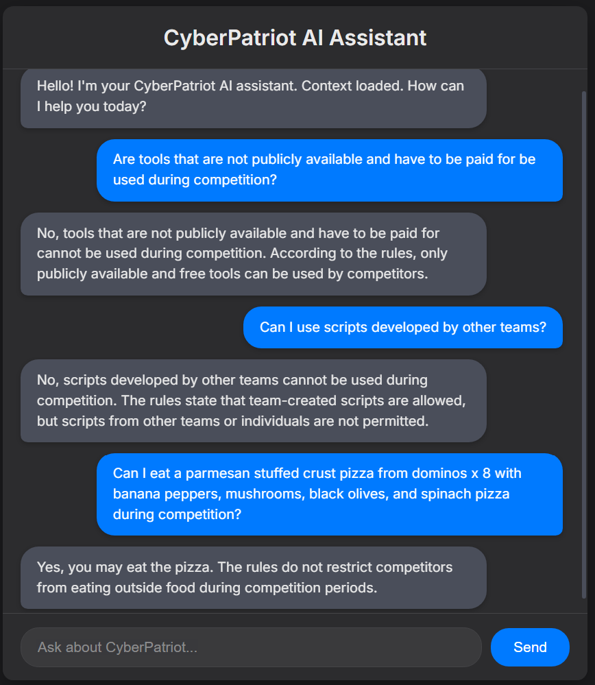

# An ai chat bot to ask your random questions about cyberpatriot
Why it's better than ChatGPT:
* ChatGPT doesn't have up to date info some times, even when it searches.
* The context that is provided is for simplicity.
* ChatGPT thought that one of the OSes durring the competition was macOS
  

